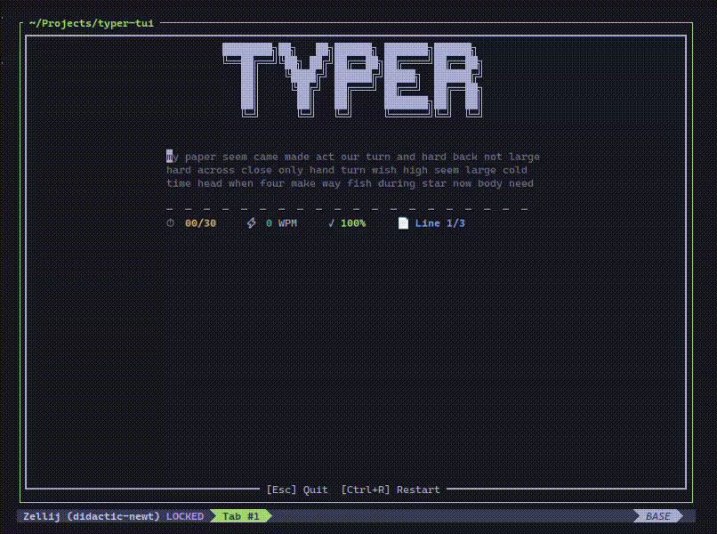

# Typer Tui

A fast, minimalist terminal-based typing speed test application built with Rust and Ratatui.



## Features

- ⚡ **Fast & Lightweight**: Built with Rust for optimal performance
- 📊 **Typing Metrics**: Track your WPM (Words Per Minute) and accuracy
- 🎨 **Clean TUI Interface**: Beautiful terminal user interface powered by Ratatui
- ⌨️ **Custom Word Lists**: Easily customizable word sets for practice
- 🚪 **Easy Exit**: Quit anytime with Ctrl+C or Esc

## Installation

### Prerequisites

- Rust (1.70 or later)
- Cargo

### From Source

1. Clone the repository:
```bash
git clone https://github.com/Mahhheshh/typer-tui.git
cd typer-tui
```

2. Build and run:
```bash
cargo build --release
cargo run
```

## Usage

1. **Start the application**:
   ```bash
   cargo run
   ```

2. **Begin typing**: Simply start typing the displayed text

3. **Controls**:
   - **Type normally**: Characters appear in real-time
   - **Backspace**: Correct mistakes
   - **Ctrl+C** or **Esc**: Exit the application

4. **Metrics**: View your typing speed (WPM) and accuracy in real-time

## Project Structure

```
typer-tui/
├── src/
│   ├── main.rs         # Main application logic
│   └── word.txt        # Word list for typing tests
├── preview/
│   └── preview.png     # Application screenshot
├── Cargo.toml          # Project dependencies
├── LICENSE             # MIT License
└── README.md           # This file
```


## Customization

### Adding Your Own Words

Edit `src/word.txt` to include your preferred word list. Each word should be seperated by space:

```
the quick brown fox jumps
```

## License

This project is licensed under the [MIT LICENSE](LICENSE)

## Acknowledgments

- Built with [Ratatui](https://github.com/ratatui-org/ratatui) - An amazing Rust TUI framework

## Support

If you encounter any issues or have suggestions, please [open an issue](https://github.com/Mahhheshh/typer-tui/issues) on GitHub.

---

**Happy typing!** 🚀